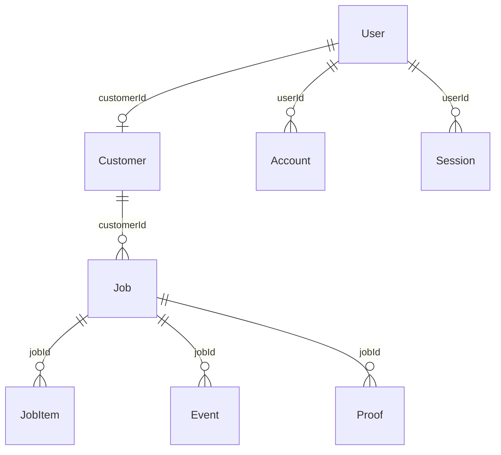

# Database Schema Documentation

The 687 Merch Site uses PostgreSQL with Prisma ORM for type-safe database operations and automatic migrations.

## Schema Overview

### Core Models

```
┌─────────────┐    ┌─────────────┐    ┌─────────────┐
│    User     │    │  Customer   │    │    Job      │
│             │    │             │    │             │
│ - id        │    │ - id        │    │ - id        │
│ - email     │───▶│ - name      │◀───│ - customerId│
│ - role      │    │ - email     │    │ - status    │
│ - customerId│    │ - phone     │    │ - dueDate   │
│             │    │ - company   │    │ - notes     │
└─────────────┘    │ - defaultShip│   └─────────────┘
                   └─────────────┘           │
                                             │
                   ┌─────────────┐           │
                   │  JobItem    │           │
                   │             │           │
                   │ - id        │◀──────────┘
                   │ - productSku│
                   │ - variant   │
                   │ - printSpec │ (JSON)
                   │ - qty       │
                   │ - sizeBreakdown │ (JSON)
                   └─────────────┘
```

## Complete Schema Definition

```prisma
// This is your Prisma schema file,
// learn more about it in the docs: https://pris.ly/d/prisma-schema

generator client {
  provider      = "prisma-client-js"
  binaryTargets = ["native", "darwin", "darwin-arm64"]
}

datasource db {
  provider  = "postgresql"
  url       = env("POSTGRES_PRISMA_URL")
  directUrl = env("POSTGRES_URL_NON_POOLING")
}

enum Role {
  ADMIN
  CUSTOMER
}

enum JobStatus {
  QUEUED
  APPROVED
  IN_PROD
  READY
  SHIPPED
  DELIVERED
}

enum ProofStatus {
  PENDING
  APPROVED
  CHANGES_REQUESTED
}

model User {
  id            String    @id @default(cuid())
  email         String    @unique
  name          String?
  role          Role      @default(CUSTOMER)
  customerId    String?   @unique
  customer      Customer? @relation(fields: [customerId], references: [id])
  emailVerified DateTime?
  accounts      Account[]
  sessions      Session[]
  createdAt     DateTime  @default(now())
  updatedAt     DateTime  @updatedAt

  @@map("users")
}

model Customer {
  id          String   @id @default(cuid())
  name        String
  email       String   @unique
  phone       String?
  company     String?
  defaultShip Json?
  user        User?
  jobs        Job[]
  createdAt   DateTime @default(now())
  updatedAt   DateTime @updatedAt

  @@map("customers")
}

model Job {
  id         String    @id @default(cuid())
  customerId String
  customer   Customer  @relation(fields: [customerId], references: [id])
  status     JobStatus @default(QUEUED)
  dueDate    DateTime?
  notes      String?
  items      JobItem[]
  events     Event[]
  proofs     Proof[]
  createdAt  DateTime  @default(now())
  updatedAt  DateTime  @updatedAt

  @@map("jobs")
}

model JobItem {
  id            String  @id @default(cuid())
  jobId         String
  job           Job     @relation(fields: [jobId], references: [id], onDelete: Cascade)
  productSku    String
  variant       String?
  printSpec     Json
  qty           Int
  sizeBreakdown Json
  createdAt     DateTime @default(now())
  updatedAt     DateTime @updatedAt

  @@map("job_items")
}

model Event {
  id        String   @id @default(cuid())
  jobId     String?
  job       Job?     @relation(fields: [jobId], references: [id], onDelete: Cascade)
  type      String
  payload   Json
  createdAt DateTime @default(now())

  @@map("events")
}

model Proof {
  id       String     @id @default(cuid())
  jobId    String
  job      Job        @relation(fields: [jobId], references: [id], onDelete: Cascade)
  imageUrl String
  version  Int
  status   ProofStatus @default(PENDING)
  notes    String?
  createdAt DateTime @default(now())
  updatedAt DateTime @updatedAt

  @@map("proofs")
}

// NextAuth.js required models
model Account {
  id                String  @id @default(cuid())
  userId            String
  user              User    @relation(fields: [userId], references: [id], onDelete: Cascade)
  type              String
  provider          String
  providerAccountId String
  refresh_token     String?
  access_token      String?
  expires_at        Int?
  token_type        String?
  scope             String?
  id_token          String?
  session_state     String?
  createdAt         DateTime @default(now())
  updatedAt         DateTime @updatedAt

  @@unique([provider, providerAccountId])
  @@map("accounts")
}

model Session {
  id           String   @id @default(cuid())
  sessionToken String   @unique
  userId       String
  user         User     @relation(fields: [userId], references: [id], onDelete: Cascade)
  expires      DateTime
  createdAt    DateTime @default(now())
  updatedAt    DateTime @updatedAt

  @@map("sessions")
}

model VerificationToken {
  identifier String
  token      String   @unique
  expires    DateTime

  @@unique([identifier, token])
  @@map("verification_tokens")
}
```

## Model Details

### User Model

**Purpose**: Authentication and role management

**Key Fields**:
- `role`: Determines access level (ADMIN or CUSTOMER)
- `customerId`: Links to Customer record for customer users
- `emailVerified`: NextAuth.js email verification status

**Relationships**:
- One-to-one with Customer (optional)
- One-to-many with Account/Session (NextAuth.js)

**Usage Examples**:
```typescript
// Find admin users
const admins = await prisma.user.findMany({
  where: { role: 'ADMIN' }
});

// Get user with customer data
const userWithCustomer = await prisma.user.findUnique({
  where: { email: 'user@example.com' },
  include: { customer: true }
});
```

### Customer Model

**Purpose**: Business information and contact details

**Key Fields**:
- `defaultShip`: JSON field containing default shipping address
- `company`: Optional company name
- `phone`: Contact phone number

**JSON Structure for defaultShip**:
```json
{
  "address": "123 Main St",
  "city": "Anytown",
  "state": "CA",
  "zipCode": "90210",
  "country": "USA"
}
```

**Relationships**:
- One-to-one with User (optional)
- One-to-many with Job

### Job Model

**Purpose**: Core job/order management

**Status Workflow**:
1. `QUEUED` - Initial state, awaiting review
2. `APPROVED` - Approved for production
3. `IN_PROD` - Currently in production
4. `READY` - Production complete, ready for shipping
5. `SHIPPED` - Shipped to customer
6. `DELIVERED` - Delivered to customer

**Key Features**:
- Optional due date
- Customer notes and special instructions
- Automatic created/updated timestamps
- Cascading deletes for related items

### JobItem Model

**Purpose**: Individual items within a job

**printSpec JSON Structure**:
```json
{
  "applique": "Garment Brand",
  "appliqueColorway": "Color",
  "costPerItem": 15.99,
  "placements": [
    {
      "id": "placement-1",
      "location": "Full Size Front",
      "width": 12,
      "height": 12,
      "art": "Company Logo",
      "decorationMethod": "HTV",
      "designFileName": "logo.png",
      "designFileUrl": "https://blob.vercel-storage.com/..."
    }
  ]
}
```

**sizeBreakdown JSON Structure**:
```json
{
  "S": 5,
  "M": 20,
  "L": 15,
  "XL": 8,
  "2XL": 2
}
```

### Event Model

**Purpose**: Audit trail and job history

**Common Event Types**:
- `job.created` - Job initially created
- `status.updated` - Status changed
- `item.added` - Item added to job
- `proof.uploaded` - Proof uploaded
- `customer.notified` - Customer notification sent

**Event Payload Examples**:
```json
// Status update event
{
  "type": "status.updated",
  "payload": {
    "oldStatus": "QUEUED",
    "newStatus": "APPROVED",
    "updatedBy": "admin",
    "reason": "Customer approval received"
  }
}

// Job creation event
{
  "type": "job.created",
  "payload": {
    "createdBy": "admin",
    "itemsCount": 3,
    "totalQty": 150,
    "itemTypes": ["SHIRT_BASIC", "HAT_TRUCKER"]
  }
}
```

### Proof Model

**Purpose**: Design proofs and approvals

**Status Values**:
- `PENDING` - Awaiting customer review
- `APPROVED` - Customer approved
- `CHANGES_REQUESTED` - Revisions needed

## Relationships & Constraints

### Foreign Key Relationships



### Cascade Behavior

**ON DELETE CASCADE**:
- Deleting a Job deletes all JobItems, Events, and Proofs
- Deleting a User deletes all Accounts and Sessions
- Customer deletion requires manual handling (business logic)

**Referential Integrity**:
- All foreign keys are enforced
- Orphaned records are prevented
- Database consistency maintained

## Indexes & Performance

### Primary Indexes
- All `@id` fields have automatic primary indexes
- `@unique` fields have unique indexes

### Recommended Additional Indexes
```sql
-- Job queries by customer
CREATE INDEX idx_jobs_customer_id ON jobs(customer_id);

-- Job queries by status
CREATE INDEX idx_jobs_status ON jobs(status);

-- Job queries by date
CREATE INDEX idx_jobs_created_at ON jobs(created_at);

-- Event queries by job
CREATE INDEX idx_events_job_id ON events(job_id);

-- User lookups by email (already unique)
-- Customer lookups by email (already unique)
```

### Query Optimization

**Efficient Job Queries**:
```typescript
// Get jobs with related data efficiently
const jobs = await prisma.job.findMany({
  where: { 
    customerId: 'customer-id',
    status: { in: ['QUEUED', 'APPROVED'] }
  },
  include: {
    customer: {
      select: { name: true, email: true, company: true }
    },
    items: {
      select: { productSku: true, qty: true, variant: true }
    },
    _count: {
      select: { events: true, proofs: true }
    }
  },
  orderBy: { createdAt: 'desc' },
  take: 50 // Pagination
});
```

## Data Migrations

### Migration Management

**Generate Migration**:
```bash
npx prisma migrate dev --name "descriptive_migration_name"
```

**Deploy to Production**:
```bash
npx prisma migrate deploy
```

**Reset Development Database**:
```bash
npx prisma migrate reset
```

### Common Migration Scenarios

**Adding New Job Status**:
```prisma
enum JobStatus {
  QUEUED
  APPROVED
  IN_PROD
  READY
  SHIPPED
  DELIVERED
  CANCELLED  // New status
}
```

**Adding New Fields**:
```prisma
model Job {
  // ... existing fields
  priority      Priority @default(NORMAL)  // New field
  estimatedDays Int?                       // New optional field
}

enum Priority {
  LOW
  NORMAL
  HIGH
  URGENT
}
```

## Seed Data

### Development Seeds

```javascript
// prisma/seed.js
const { PrismaClient } = require('@prisma/client');
const prisma = new PrismaClient();

async function main() {
  // Create admin user
  const adminUser = await prisma.user.upsert({
    where: { email: 'info@687merch.com' },
    update: {},
    create: {
      email: 'info@687merch.com',
      name: 'Admin User',
      role: 'ADMIN',
    },
  });

  // Create test customer
  const testCustomer = await prisma.customer.upsert({
    where: { email: 'test@example.com' },
    update: {},
    create: {
      name: 'Test Customer',
      email: 'test@example.com',
      phone: '(555) 123-4567',
      company: 'Test Company Inc',
      defaultShip: {
        address: '123 Main St',
        city: 'Anytown',
        state: 'CA',
        zipCode: '90210'
      }
    },
  });

  // Create sample jobs with different statuses
  // ... additional seed data
}
```

### Production Seeds

**Initial Setup Only**:
- Admin users
- System configurations
- Reference data

**Avoid in Production**:
- Test customers
- Sample jobs
- Development-only data

## Backup & Recovery

### Database Backups

**Automated Backups** (Recommended):
- Use your PostgreSQL hosting provider's backup features
- Schedule daily backups with point-in-time recovery
- Test restore procedures regularly

**Manual Backup**:
```bash
pg_dump -h hostname -U username -d database_name > backup.sql
```

**Restore from Backup**:
```bash
psql -h hostname -U username -d database_name < backup.sql
```

### Data Recovery Scenarios

**Accidental Data Deletion**:
1. Stop application to prevent further changes
2. Restore from latest backup
3. Apply any necessary migrations
4. Validate data integrity

**Schema Corruption**:
1. Reset database schema using Prisma
2. Restore data from backup
3. Run data validation queries

## Security Considerations

### Data Protection

**Sensitive Information**:
- Customer contact details
- Business information
- Design files and intellectual property
- Order histories and patterns

**Access Controls**:
- Role-based access (ADMIN vs CUSTOMER)
- Customer data isolation
- API endpoint authentication
- Database connection security

### PII Handling

**Personal Information**:
- Customer names and contact info
- Shipping addresses
- Email addresses

**GDPR Compliance** (if applicable):
- Data retention policies
- Right to deletion
- Data export capabilities
- Consent management

## Monitoring & Maintenance

### Database Health

**Key Metrics to Monitor**:
- Connection pool usage
- Query performance
- Storage usage
- Error rates

**Maintenance Tasks**:
- Regular VACUUM operations (PostgreSQL)
- Index maintenance
- Statistics updates
- Log rotation

### Performance Optimization

**Query Analysis**:
```sql
-- Enable query logging
SET log_statement = 'all';
SET log_min_duration_statement = 1000; -- Log slow queries

-- Analyze query performance
EXPLAIN ANALYZE SELECT ...;
```

**Connection Pooling**:
- Use connection pooling (PgBouncer recommended)
- Monitor pool utilization
- Tune pool size based on usage

This database schema provides a solid foundation for the 687 Merch Site while remaining flexible for future enhancements and scaling.