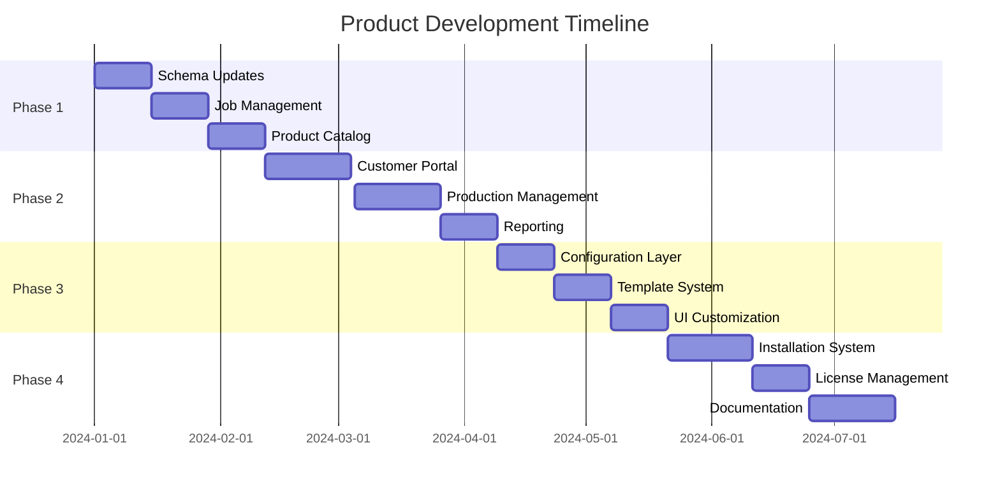

# Product Development Plans

This directory contains comprehensive documentation for the 687 Merch Site evolution from a single-business solution to a configurable product for the custom merchandise industry.

## Development Strategy

The project follows a phased approach that prioritizes immediate business value while building the foundation for a future configurable product offering.

### Business Model Evolution
- **Current**: Single-tenant application for 687 Merch business
- **Target**: Self-hosted license model for small custom merch shops
- **Revenue Model**: One-time license fee + hourly support

## Phase Documentation

### [Phase 1: Business MVP (4-6 weeks)](./phase-1-business-mvp.md)
**Priority**: Fix current operations and deliver immediate value
- Update job status workflow to match actual business process
- Enhance product catalog structure
- Implement proper design file management
- Add basic employee assignment system

### [Phase 2: Business Value Features (6-8 weeks)](./phase-2-business-value.md)
**Priority**: Advanced features that improve daily operations
- Enhanced customer portal with approval workflows
- Production scheduling and management
- Material tracking and cost calculation
- Reporting and analytics dashboard

### [Phase 3: Configurability Foundation (4-6 weeks)](./phase-3-configurability.md)
**Priority**: Build flexibility for future customers
- Configuration layer for business settings
- Template system for products and workflows
- UI customization capabilities
- Export/import functionality

### [Phase 4: Package for Distribution (6-8 weeks)](./phase-4-distribution.md)
**Priority**: Transform into distributable product
- Installation and setup wizards
- License validation system
- Documentation and training materials
- Support infrastructure

## Architecture Principles

### Future-Proofing Guidelines
1. **Configuration-Driven**: Build features that can be customized per business
2. **Template-Based**: Create reusable patterns for different shop types
3. **Modular Design**: Components that work across different configurations
4. **Data Ownership**: Self-hosted model with complete data control

### Technical Foundations
- **Database**: PostgreSQL with Prisma ORM
- **Framework**: Next.js with TypeScript
- **Authentication**: NextAuth.js with role-based access
- **File Storage**: Vercel Blob (configurable for self-hosted)
- **UI**: Material-UI with themeable components

## Success Metrics

### Phase 1 Success Criteria
- [ ] Job status workflow matches actual business process
- [ ] Job creation time reduced by 50%
- [ ] Proper product catalog structure implemented
- [ ] Design file management separated from job data
- [ ] Basic employee assignment functionality

### Phase 2 Success Criteria
- [ ] Customer portal reduces support inquiries by 30%
- [ ] Production scheduling provides workflow clarity
- [ ] Material tracking reduces waste
- [ ] Accurate job costing and profitability tracking

### Phase 3 Success Criteria
- [ ] Business settings system fully functional
- [ ] Template system allows easy customization
- [ ] UI can be rebranded in under 1 hour
- [ ] Complete configuration export/import

### Phase 4 Success Criteria
- [ ] New customer setup takes under 30 minutes
- [ ] Installation success rate above 90%
- [ ] Complete documentation and training materials
- [ ] Support ticketing system operational

## Market Analysis

### Target Market: Small Custom Merch Shops
- **Size**: 1-5 employees
- **Revenue**: $100k-500k annually
- **Current Tools**: Spreadsheets, basic software
- **Pain Points**: Manual processes, poor customer communication, no workflow management

### Competitive Advantages
- **Industry-Specific**: Built by merch professionals for merch shops
- **Proven Workflow**: Based on successful real-world implementation
- **Data Ownership**: Self-hosted model with complete control
- **Cost Effective**: One-time license vs ongoing SaaS fees

### Revenue Projections
- **License Fee**: $1,500-3,000 per customer
- **Support Rate**: $75-125/hour
- **Year 1 Target**: 25 customers = $62,500+ base revenue
- **Year 2 Target**: 50 customers = $125,000+ base revenue
- **Year 3 Target**: 100 customers = $250,000+ base revenue

## Implementation Timeline



## Change Management

### Database Migration Strategy
- Comprehensive backup before each phase
- Incremental migrations with rollback capability
- Data validation at each step
- No breaking changes during active development

### Feature Flag System
Features will be built with configuration flags to enable smooth transition:
```typescript
interface BusinessConfig {
  features: {
    employeeManagement: boolean;
    materialTracking: boolean;
    advancedReporting: boolean;
    vendorIntegrations: boolean;
  }
}
```

## Getting Started

To begin implementation:

1. **Review Phase 1 Plan**: Start with [Phase 1 documentation](./phase-1-business-mvp.md)
2. **Database Backup**: Create full backup before schema changes
3. **Feature Branch**: Create `feature/phase-1-business-mvp` branch
4. **Track Progress**: Use todo system to monitor implementation progress

## Documentation Standards

Each phase document should include:
- **Overview**: What this phase accomplishes
- **Technical Requirements**: Database changes, new models, API updates
- **User Interface Changes**: New screens, modified workflows
- **Testing Criteria**: How to validate successful implementation
- **Rollback Plan**: How to revert if issues arise
- **Migration Notes**: Data migration requirements and scripts

---

This structured approach ensures we deliver immediate value to the 687 Merch business while building a solid foundation for the future configurable product offering.